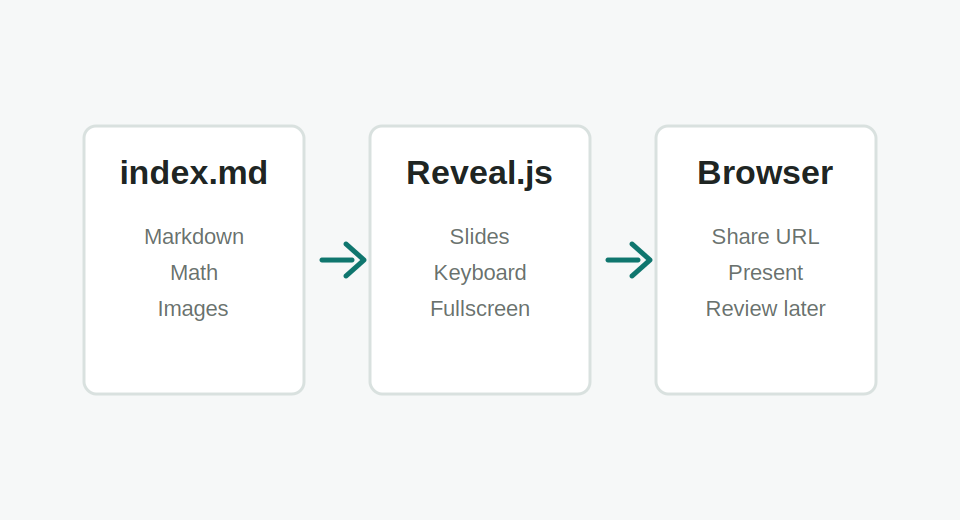

# Online Slides System

Huilong Ren

Browser-first decks for posts, tools, research notes, and teaching.

---

# Outline

- One Markdown file defines one deck
- `#` after the cover becomes a section or outline page
- `##` creates ordinary content pages
- The final page is styled as the closing slide

---

## Authoring workflow

### Deck folder

```text
slides/YYYY-MM-DD-slug/
  index.md
  images/
  videos/
  data/
```

### Local assets



Keep figures, videos, and data next to the deck.

---

## Color templates

Use the theme buttons in the upper-right corner.

<div class="theme-swatch-row">
  <div class="theme-swatch paper"><span></span>Paper</div>
  <div class="theme-swatch sage"><span></span>Sage</div>
  <div class="theme-swatch midnight"><span></span>Midnight</div>
  <div class="theme-swatch amber"><span></span>Amber</div>
</div>

---

## Conclusion

<div class="equation-box" markdown="1">

$$
\text{Deck} = \text{Markdown} + \text{Assets} + \text{Browser}
$$

</div>

- One folder becomes one deck
- Assets stay next to the deck
- Keyboard presentation works in the browser
- Math still works: \( a^2 + b^2 = c^2 \)

Slides now sit beside posts and tools as a first-class content area.
